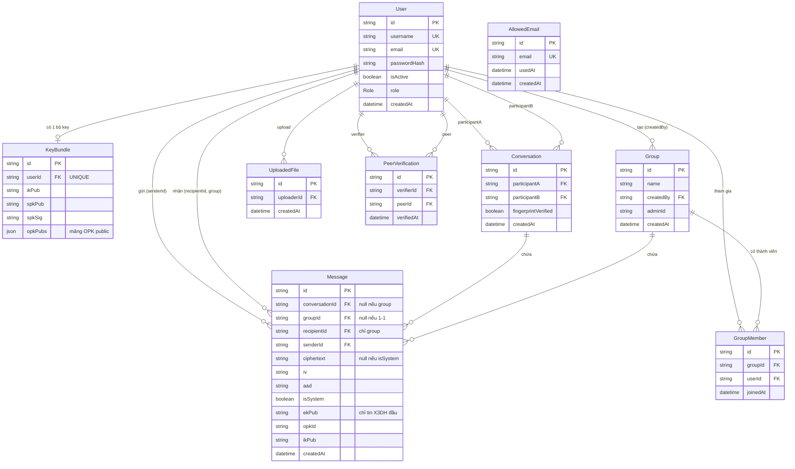
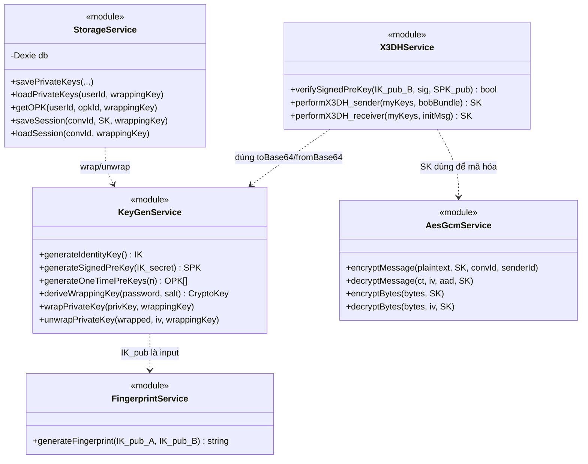
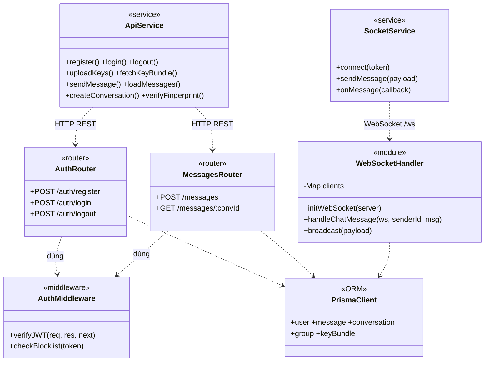
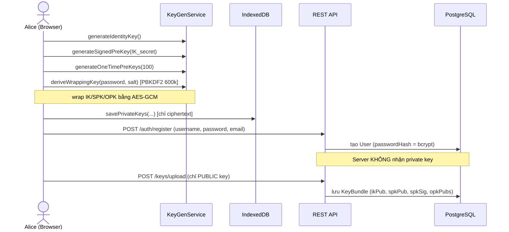
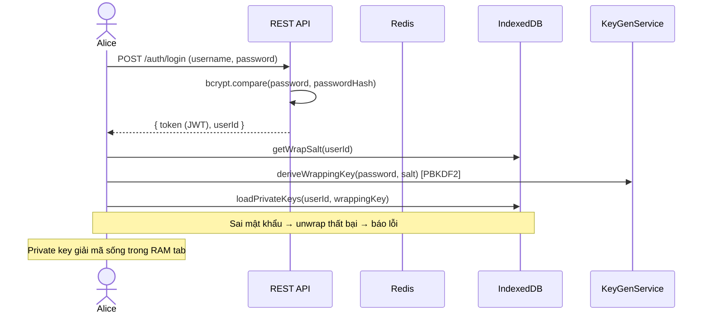
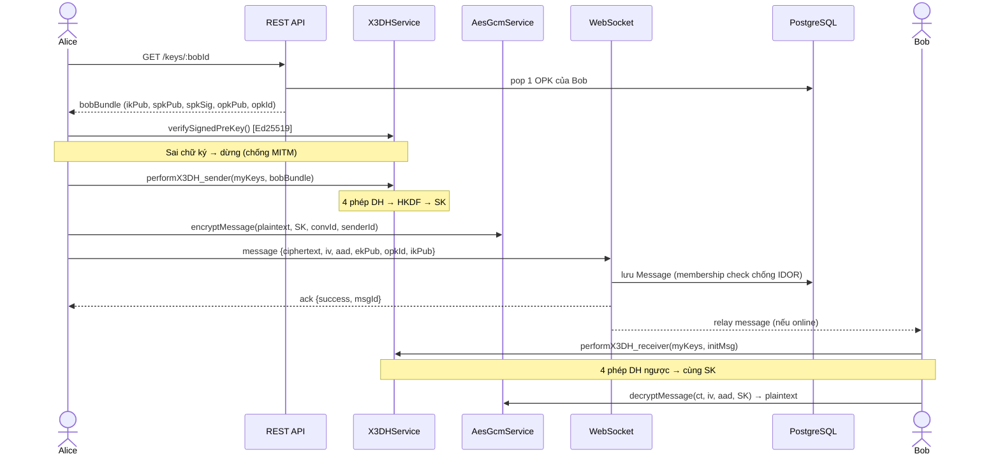
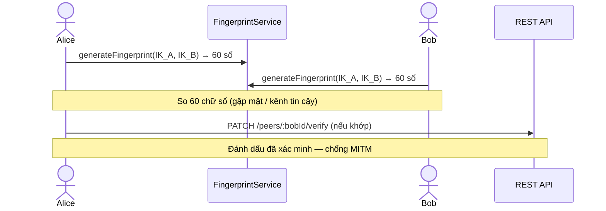

# Hướng dẫn vẽ Class Diagram, Sequence Diagram, ERD cho đồ án E2EE Chat

> Tài liệu này hướng dẫn **cách vẽ** 3 loại sơ đồ cho báo cáo, **bám sát code thật** của dự án.
> Mọi tên class/hàm/bảng trong đây đều lấy đúng từ source — vẽ theo là khớp 100% với code, không sợ thầy bắt lỗi "vẽ một đằng code một nẻo".
>
> **Công cụ đề xuất:** dùng **Mermaid** (chèn được vào Markdown, VS Code, GitHub, Notion; hoặc dán vào https://mermaid.live để xuất PNG/SVG). Mỗi sơ đồ bên dưới đều có sẵn code Mermaid — copy là ra hình. Nếu thầy yêu cầu chuẩn UML "đẹp" hơn thì dùng **draw.io (diagrams.net)** vẽ lại theo đúng cấu trúc này.

---

## 0. Nguyên tắc chung trước khi vẽ

Dự án có **2 tầng tách biệt**, phải vẽ phản ánh đúng điều này (đây là điểm cộng khi bảo vệ — thể hiện mô hình **Blind Server**):

| Tầng | Ngôn ngữ | Vai trò bảo mật |
|---|---|---|
| **Client (frontend/)** | React + JS | Nơi DUY NHẤT có plaintext + private key. Mã hóa/giải mã ở đây. |
| **Server (backend/)** | Node.js | Chỉ thấy **ciphertext + public key + metadata**. Không bao giờ thấy plaintext/private key. |

**Code của bạn viết theo kiểu module hàm, không phải OOP.** Vì vậy quy ước mô hình hóa:
- Mỗi **file module crypto/service** → 1 class với stereotype `«module»`, các hàm export → method (gạch chân vì là static).
- Mỗi **Prisma model** → 1 entity class (trong ERD là 1 bảng).
- Mỗi **route backend** → gom thành class `«router»`.

> 👉 Khi thầy hỏi "sao class này không có thuộc tính private/getter-setter?": trả lời rằng *"Hệ thống dùng kiến trúc functional-module ở client (JS module), nên em mô hình hóa mỗi module thành một class tiện ích (utility class) với các phương thức tĩnh — đây là cách biểu diễn UML chuẩn cho mã không thuần OOP."*

---

## 1. ERD (Entity Relationship Diagram) — DỄ NHẤT, VẼ TRƯỚC

### 1.1. Lấy dữ liệu từ đâu?
Toàn bộ ERD nằm trong **1 file duy nhất**: [backend/prisma/schema.prisma](backend/prisma/schema.prisma).
Mỗi `model` = 1 bảng (entity). Mỗi `@relation` = 1 đường nối. `@unique`, `@index` là ràng buộc.

### 1.2. Danh sách 8 bảng + 1 enum

| Entity | Vai trò | Khóa chính | Ghi chú bảo mật |
|---|---|---|---|
| **User** | Người dùng | `id` (uuid) | Chỉ lưu `passwordHash` (bcrypt), KHÔNG lưu password thô |
| **KeyBundle** | Bộ public key của user | `id` | Chỉ chứa **public** key (ikPub, spkPub, spkSig, opkPubs) |
| **Conversation** | Cuộc trò chuyện 1-1 | `id` | Có cờ `fingerprintVerified` |
| **Group** | Nhóm chat | `id` | `createdBy` (bất biến) ≠ `adminId` (đổi được) |
| **GroupMember** | Thành viên nhóm | `id` | Bảng nối N-N giữa User và Group |
| **Message** | Tin nhắn đã mã hóa | `id` | Dùng chung 1-1 và group; chỉ chứa `ciphertext/iv/aad` |
| **UploadedFile** | Metadata file đã upload | `id` | Nội dung thật nằm ở filesystem, không ở DB |
| **PeerVerification** | Trạng thái xác minh fingerprint | `id` | Độc lập, verify 1 lần dùng mọi nơi |
| **AllowedEmail** | Whitelist email được đăng ký | `id` | Bảng độc lập, không nối ai |
| `Role` (enum) | USER / ADMIN | — | Gắn vào User |

### 1.3. Quan hệ (cardinality) — đọc kỹ để vẽ đúng đầu mũi tên

- User **1 —— 0..1** KeyBundle (mỗi user có tối đa 1 bộ key; `userId @unique`)
- User **1 —— N** Message (vai trò *sender* qua `senderId`)
- User **1 —— N** Message (vai trò *recipient* qua `recipientId`, chỉ dùng cho group)
- User **1 —— N** Conversation (vai trò *participantA*) và **1 —— N** (vai trò *participantB*)
- Conversation **1 —— N** Message
- User **1 —— N** Group (vai trò *creator* qua `createdBy`)
- Group **1 —— N** GroupMember **N —— 1** User (GroupMember là bảng trung gian N-N)
- Group **1 —— N** Message
- User **1 —— N** UploadedFile (vai trò *uploader*)
- User **1 —— N** PeerVerification (vai trò *verifier*) và **1 —— N** (vai trò *peer*)
- AllowedEmail: đứng riêng, không quan hệ.

### 1.4. Code Mermaid ERD (copy vào mermaid.live)



> **Điểm cần giải thích khi bảo vệ:**
> - `Message` là bảng *polymorphic*: dùng chung cho cả 1-1 (`conversationId` có giá trị, `groupId`/`recipientId` null) và group (ngược lại). Nói rõ điều này.
> - Group chat = **"N tin 1-1 song song"**: 1 tin group gửi cho N người sẽ tạo **N row Message** (mỗi row 1 bản mã riêng cho từng `recipientId`). Đây là lý do `Message` có `recipientId`.
> - Các `@@unique([conversationId, iv])` / `@@unique([groupId, recipientId, iv])` là cơ chế **chống replay attack** — nên ghi chú trên sơ đồ hoặc thuyết minh.

---

## 2. Class Diagram

### 2.1. Cách lấy dữ liệu
- **Client crypto** → đọc các file trong [frontend/src/crypto/](frontend/src/crypto/) và [frontend/src/db/storage.js](frontend/src/db/storage.js). Mỗi `export function` = 1 method.
- **Client service** → [frontend/src/services/api.js](frontend/src/services/api.js) (REST) và `socket.js` (WebSocket).
- **Server** → [backend/ws/handler.js](backend/ws/handler.js), [backend/middleware/auth.js](backend/middleware/auth.js), các file trong `backend/routes/`.
- **Entity** → Prisma models (như ERD).

### 2.2. Phân nhóm class theo tầng (vẽ thành các "package")

**Package CRYPTO (client) — trái tim bảo mật:**

| Class «module» | File | Method chính (lấy đúng tên hàm export) |
|---|---|---|
| `KeyGenService` | keyGen.js | `generateIdentityKey()`, `generateSignedPreKey()`, `generateOneTimePreKeys()`, `deriveWrappingKey()`, `wrapPrivateKey()`, `unwrapPrivateKey()` |
| `X3DHService` | x3dh.js | `verifySignedPreKey()`, `performX3DH_sender()`, `performX3DH_receiver()` |
| `AesGcmService` | aesGcm.js | `encryptMessage()`, `decryptMessage()`, `encryptBytes()`, `decryptBytes()`, `encryptBytesWithRandomKey()`, `decryptBytesWithKey()` |
| `FingerprintService` | fingerprint.js | `generateFingerprint()` |

**Package STORAGE (client):**

| Class «module» | File | Method chính |
|---|---|---|
| `StorageService` | db/storage.js | `savePrivateKeys()`, `loadPrivateKeys()`, `getOPK()`, `deleteOPK()`, `saveSession()`, `loadSession()`, `saveMoreOPKs()`, `updateSPK()`, `exportKeysToFile()`, `importKeysFromFile()` |

**Package SERVICE (client):**

| Class «module» | File | Method chính |
|---|---|---|
| `ApiService` | services/api.js | `register()`, `login()`, `logout()`, `uploadKeys()`, `fetchKeyBundle()`, `sendMessage()`, `loadMessages()`, `createConversation()`, `verifyFingerprint()`, `createGroup()`, `verifyPeer()`, `searchUsers()`… (~30 hàm) |
| `SocketService` | services/socket.js | kết nối WebSocket, gửi/nhận tin real-time |

**Package SERVER (backend):**

| Class | File | Vai trò |
|---|---|---|
| `WebSocketHandler` «module» | ws/handler.js | `initWebSocket()`, `onConnect()`, `handleChatMessage()`, `broadcast()`, `broadcastToGroupMembers()` — giữ `clients: Map<userId, WebSocket>` |
| `AuthMiddleware` «module» | middleware/auth.js | verify JWT + check Redis blocklist |
| `AuthRouter`, `KeysRouter`, `MessagesRouter`, `ConversationsRouter`, `GroupsRouter`, `PeersRouter`, `UsersRouter`, `FilesRouter`, `AdminRouter` «router» | routes/*.js | Xử lý REST endpoint tương ứng |

### 2.3. Class diagram Mermaid — TẦNG CRYPTO CLIENT (vẽ riêng cho rõ)



### 2.4. Class diagram Mermaid — KIẾN TRÚC TỔNG (client ↔ server)



> **Lưu ý khi vẽ:** nếu thầy muốn 1 sơ đồ tổng duy nhất thì gộp 2.3 + 2.4. Nếu muốn rõ ràng để chấm điểm thì **tách 2 sơ đồ** như trên (1 cho crypto, 1 cho kiến trúc) — dễ trình bày hơn.

---

## 3. Sequence Diagram

Đây là loại quan trọng nhất để chứng minh bạn hiểu **luồng E2EE**. Vẽ tối thiểu 4 luồng dưới đây.

### 3.1. Các "actor / participant" dùng chung
- **Alice** / **Bob** (2 browser)
- **IndexedDB** (lưu private key đã mã hóa, phía client)
- **REST API** (Express)
- **WebSocket** (relay)
- **PostgreSQL** (DB)
- **Redis** (JWT blocklist)

### 3.2. Luồng 1 — Đăng ký + sinh khóa (chứng minh private key không rời client)



> **Câu thuyết minh:** *"Private key được sinh và mã hóa hoàn toàn trong browser, chỉ lưu ở IndexedDB. Server chỉ nhận public key — đây là bản chất mô hình Blind Server."*

### 3.3. Luồng 2 — Đăng nhập + mở khóa private key



### 3.4. Luồng 3 — Gửi tin nhắn ĐẦU TIÊN (X3DH) ⭐ QUAN TRỌNG NHẤT



> **Điểm nhấn:** `ekPub`, `opkId`, `ikPub` **chỉ gửi kèm tin đầu tiên** để Bob tính lại SK. Tin sau dùng SK đã lưu, không gửi lại.

### 3.5. Luồng 4 — Gửi tin nhắn THƯỜNG (đã có Session Key)

```mermaid
sequenceDiagram
    actor Alice
    participant IDB as IndexedDB
    participant AES as AesGcmService
    participant WS as WebSocket
    participant DB as PostgreSQL
    actor Bob

    Alice->>IDB: loadSession(convId) → SK
    Alice->>AES: encryptMessage(plaintext, SK, convId, senderId)
    Alice->>WS: message {ciphertext, iv, aad}
    WS->>WS: membership check (chống IDOR)
    WS->>DB: lưu Message TRƯỚC khi relay
    WS-->>Bob: relay (nếu online); offline → load lại sau
    WS-->>Alice: ack
    Bob->>IDB: loadSession(convId) → SK
    Bob->>AES: decryptMessage(...) → plaintext
```

### 3.6. (Tùy chọn) Luồng 5 — Xác minh Fingerprint



---

## 4. Thứ tự vẽ đề xuất & checklist bảo vệ

**Thứ tự nên làm:**
1. **ERD** trước (dễ, lấy thẳng từ schema.prisma).
2. **Sequence diagram luồng X3DH (3.4)** — quan trọng nhất, thầy chắc chắn hỏi.
3. **Class diagram tầng crypto (2.3)**.
4. Bổ sung các luồng/sơ đồ còn lại.

**Checklist trước khi nộp — đối chiếu sơ đồ với code:**
- [ ] Mọi tên bảng/cột trong ERD khớp `schema.prisma`.
- [ ] Mọi tên method trong class diagram khớp `export function` trong code.
- [ ] Sequence diagram thể hiện rõ: **private key không rời client**, **server chỉ thấy ciphertext**.
- [ ] Có chú thích các cơ chế bảo mật: PBKDF2 600k, Ed25519 verify (chống MITM), membership check (chống IDOR), `@@unique(iv)` (chống replay).
- [ ] Group chat được mô tả đúng là **"N tin 1-1 song song"** (N row Message).

**3 câu thầy hay hỏi — chuẩn bị sẵn:**
1. *"Private key có gửi lên server không?"* → Không. Sinh + mã hóa + lưu IndexedDB tại client (xem Sequence 3.2).
2. *"Server đọc được tin nhắn không?"* → Không. Chỉ lưu ciphertext/iv/aad (xem ERD bảng Message + Sequence 3.4).
3. *"Làm sao 2 bên có cùng khóa mà không gửi khóa qua mạng?"* → X3DH: 4 phép Diffie-Hellman + HKDF, hai phía tính ra cùng SK (xem Sequence 3.4).

---

## 5. Mẹo công cụ

- **Mermaid Live** (https://mermaid.live): dán code → Export PNG/SVG để chèn Word.
- **VS Code**: cài extension *Markdown Preview Mermaid Support* để xem trực tiếp file này.
- **draw.io**: nếu cần sơ đồ UML "đúng chuẩn ký hiệu" (hình thoi quan hệ, mũi tên kế thừa…), vẽ tay theo đúng các bảng/quan hệ ở trên.
- Xuất hình **độ phân giải cao** (SVG hoặc PNG ≥ 2x) để in báo cáo không bị vỡ chữ.
</content>
</invoke>
